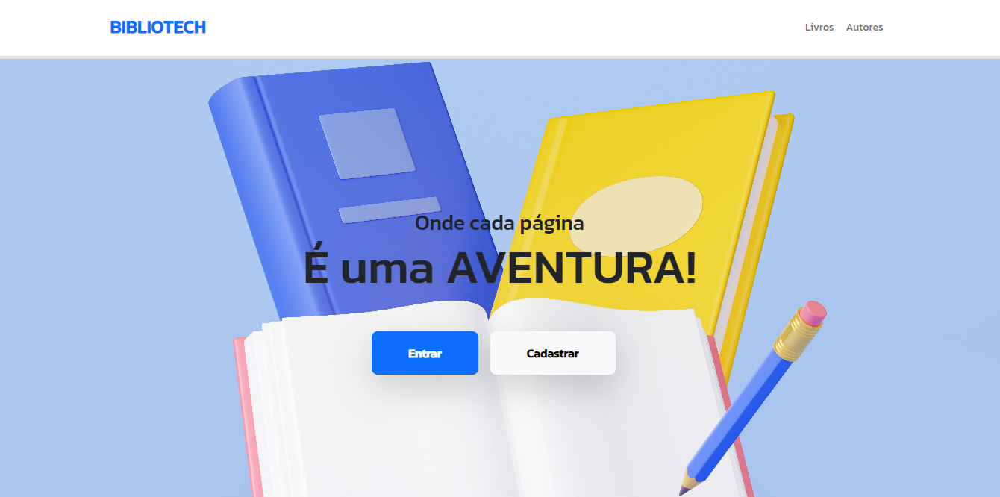
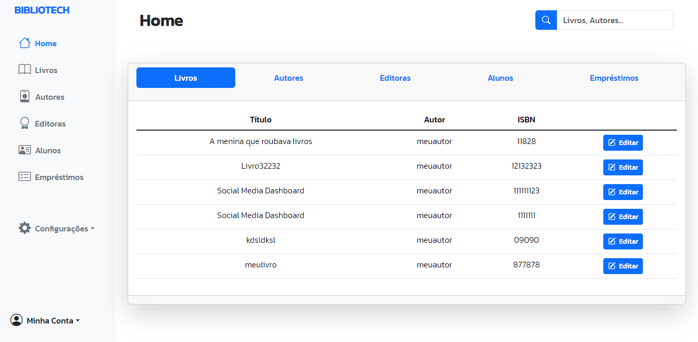

<h1 align="center">
   
  <a href="http://github.com/Cunegundess/Bibliotech">
   
  BiblioTech
   
  </a>
</h1>

<h4 align="center">Um sistema de gerenciamento bibliotecário utilizando <a href="https://www.djangoproject.com/" target="_blank">Django</a> e <a href="https://www.django-rest-framework.org/" target="_blank">Django REST Framework</a>.</h4>

<!-- TABLE OF CONTENTS -->

  
Sumário

  <ol>
    <li>
      <a href="#Sobre-o-Projeto">Sobre o Projeto</a>
      <ul>
        <li><a href="#Instalação">Instalação</a></li>
        <li><a href="#Uso">Uso</a></li>
      </ul>
    </li>
    <li><a href="#Tecnologias">Tecnologias</a></li>
    <li><a href="#Dependências">Dependências</a></li>
    <li><a href="#Contato">Contato</a></li>
  </ol>

# Sobre o Projeto 📚

<h2>Bem-vindo ao Bibliotech 👋🏻</h2>

O **Bibliotech** é um sistema de gerenciamento bibliotecário completo, desenvolvido para simplificar e aprimorar a gestão de bibliotecas. Este projeto tem como objetivo fornecer uma solução abrangente para o gerenciamento de acervos, empréstimos, e usuários de bibliotecas.

    
    
    

"Dados meramente ilustrativos"

O **Bibliotech** é perfeito para bibliotecas de todos os tamanhos, oferecendo uma gama de recursos para gerenciamento de livros, usuários, empréstimos e muito mais. Explore o potencial do **Bibliotech** hoje e simplifique a gestão da sua biblioteca.

 

## Instalação

Para executar o Bibliotech localmente, siga estas etapas:

1. Clone o repositório:

    `git clone https://github.com/Cunegundess/Bibliotech.git`

3. Vá para o diretório do projeto:

    `cd Bibliotech`

3. Crie a venv:

    `python -m venv env`

4. Ative a venv:

    `source env/bin/activate`

5. Instale as dependências:

    `pip install -r requirements.txt`

6. Execute o servidor:

    `python manage.py runserver`

A aplicação estará disponível em http://localhost:8000

 

## Uso

O Bibliotech fornece uma API REST para suportar o sistema de gerenciamento bibliotecário. Ele gerencia dados relacionados a livros, usuários e empréstimos, fornecendo recursos para visualização e gerenciamento dessas informações. 

A API estará disponível em http://localhost:8000/api

# Tecnologias 🧑🏻‍💻

O Bibliotech é construído utilizando as seguintes tecnologias:

   

- Django e Django REST Framework: Fundamentais para a lógica e a API do backend.
- Bootstrap: Utilizado para o desenvolvimento do frontend, fornecendo um design responsivo e agradável.
- jQuery: Facilita a manipulação do DOM e interações dinâmicas no frontend.

## Dependências

O projeto depende das seguintes bibliotecas:

- `django`: Framework web para construção do backend.
- `djangorestframework`: Biblioteca para construção de APIs REST no Django.
- `bootstrap`: Framework front-end para estilização e responsividade.
- `jquery`: Biblioteca JavaScript para interações e manipulações do DOM.

 

# Contato 📨

Se tiver alguma dúvida ou sugestão, entre em contato:

Seu Nome - [LinkedIn](https://www.linkedin.com/in/seunome) - seuemail@example.com

